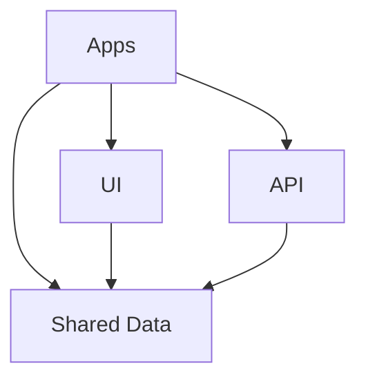

# 📚 Bibliotecas Compartilhadas - Jornada 30 Dias

Este documento descreve as três bibliotecas compartilhadas criadas para o workspace Nx da Jornada 30 Dias.

## 🎨 **UI Library** (`@jornada-30-dias/ui`)

### 📍 Localização
```
libs/ui/
├── src/
│   ├── lib/
│   │   ├── components/    # Componentes reutilizáveis
│   │   ├── directives/    # Diretivas personalizadas
│   │   ├── pipes/         # Pipes customizados
│   │   ├── types/         # Tipos e interfaces UI
│   │   └── tokens/        # Tokens de injeção de dependência
│   └── index.ts           # Exports públicos
```

### 🎯 **Propósito**
Componentes de interface do usuário reutilizáveis para toda a aplicação.

### 📦 **Componentes Planejados**

#### Componentes Básicos
- ✅ **Button** - Botão customizável com variantes, tamanhos e estados
- 🔄 **Card** - Cartões para exibir conteúdo
- 🔄 **Modal** - Janelas modais
- 🔄 **Input** - Campos de entrada
- 🔄 **Loading** - Indicadores de carregamento

#### Componentes de Navegação
- 🔄 **Navbar** - Barra de navegação
- 🔄 **Sidebar** - Menu lateral

#### Componentes de Layout
- 🔄 **Container** - Container responsivo
- 🔄 **Grid** - Sistema de grid

#### Componentes de Feedback
- 🔄 **Alert** - Alertas e notificações
- 🔄 **Toast** - Notificações toast

### 📝 **Exemplo de Uso**
```typescript
import { ButtonComponent } from '@jornada-30-dias/ui';

@Component({
  template: `
    <lib-button 
      variant="primary" 
      size="md" 
      [loading]="isLoading"
      (clicked)="handleClick()">
      Clique aqui
    </lib-button>
  `
})
export class MyComponent {}
```

### 🎨 **Sistema de Design**
- **Variantes**: primary, secondary, success, danger, warning, info, light, dark
- **Tamanhos**: xs, sm, md, lg, xl
- **Tema configurável** via DI tokens
- **Classes CSS padronizadas**

---

## 🔄 **Shared Data Library** (`@jornada-30-dias/shared-data`)

### 📍 Localização
```
libs/shared-data/
├── src/
│   ├── lib/
│   │   ├── interfaces/    # Interfaces principais
│   │   ├── models/        # Modelos de domínio
│   │   ├── types/         # Tipos utilitários
│   │   ├── enums/         # Enumerações
│   │   ├── utils/         # Utilitários
│   │   └── constants/     # Constantes
│   └── index.ts           # Exports públicos
```

### 🎯 **Propósito**
Interfaces, models, tipos e utilitários compartilhados entre diferentes partes da aplicação.

### 📦 **Estruturas Implementadas**

#### Interfaces
- ✅ **User Interface** - Estrutura completa de usuários
  - User, UserProfile, UserAddress, UserSettings
  - CreateUserDto, UpdateUserDto, LoginDto
- ✅ **API Response Interface** - Respostas padronizadas da API
  - ApiResponse<T>, PaginatedApiResponse<T>
  - ApiErrorResponse, ValidationError

#### Estruturas Planejadas
- 🔄 **Models** - Classes de domínio
- 🔄 **Types** - Tipos utilitários
- 🔄 **Enums** - Enumerações
- 🔄 **Utils** - Funções utilitárias
- 🔄 **Constants** - Constantes da aplicação

### 📝 **Exemplo de Uso**
```typescript
import { User, ApiResponse } from '@jornada-30-dias/shared-data';

interface GetUsersResponse extends ApiResponse<User[]> {}

function processUser(user: User) {
  console.log(`Usuário: ${user.name} (${user.email})`);
  console.log(`Status: ${user.status}`);
}
```

### 🔧 **Funcionalidades**
- **Tipagem forte** para toda a aplicação
- **Validação de dados** consistente
- **DTOs** para comunicação com APIs
- **Interfaces extensíveis** e reutilizáveis

---

## 🌐 **API Library** (`@jornada-30-dias/api`)

### 📍 Localização (Estrutura Simplificada)
```
libs/api/
├── src/
│   ├── lib/
│   │   ├── services/external/        # Serviços das APIs do curso
│   │   │   ├── shikimori.service.ts     # 🔄 Semana 1 - Anime
│   │   │   ├── cats.service.ts          # 🔄 Semana 2 - Gatos IA
│   │   │   ├── hypixel.service.ts       # 🔄 Semana 3 - Minecraft
│   │   │   └── flyff.service.ts         # 🔄 Semana 4 - MMORPG
│   │   └── config/                   # Configurações
│   │       └── endpoints.config.ts      # ✅ URLs e configs
│   └── index.ts                      # Exports públicos
```

### 🎯 **Propósito**
Configurações e exemplos para implementar serviços que consomem as 4 APIs públicas utilizadas durante a Jornada 30 Dias. **Os serviços usam HttpClient diretamente** para facilitar o aprendizado.

### 📦 **APIs por Semana do Curso**

#### Semana 1 - Shikimori API (Anime/Manga)
- 🔄 **ShikimoriService** - HttpClient direto para animes
- **Projeto**: Lista de Personagens de Anime
- **Aprendizado**: GET requests, Observables, tipos TypeScript
- **Endpoints**: `/animes`, `/characters`, `/mangas`

#### Semana 2 - AI Cats API (Gatos IA)
- 🔄 **CatsService** - Headers, error handling, RxJS  
- **Projeto**: Galeria de Gatos Fofos
- **Aprendizado**: POST requests, headers, operators RxJS
- **Endpoints**: `/images/search`, `/breeds`, `/favourites`

#### Semana 3 - Hypixel API (Minecraft)
- 🔄 **HypixelService** - API keys, comunicação entre MFEs
- **Projeto**: Dashboard Minecraft (Microfrontend)
- **Aprendizado**: Microfrontends, Module Federation
- **Endpoints**: `/player`, `/status`, `/guild`

#### Semana 4 - Flyff Game API (MMORPG)
- 🔄 **FlyffService** - Integração final, autenticação avançada
- **Projeto**: Painel Flyff Unificado (Integração de todas as APIs)
- **Aprendizado**: Testes, autenticação, integração completa
- **Endpoints**: `/character`, `/guild`, `/rankings`, `/servers`

### 📝 **Exemplo de Uso Simplificado**
```typescript
// Semana 1 - Implementação direta com HttpClient
@Injectable({ providedIn: 'root' })
export class ShikimoriService {
  private readonly baseUrl = 'https://shikimori.one/api';

  constructor(private http: HttpClient) {}

  getAnimes(params?: any): Observable<Anime[]> {
    return this.http.get<Anime[]>(`${this.baseUrl}/animes`, { params });
  }
}

// Semana 4 - Implementação com autenticação
@Injectable({ providedIn: 'root' })
export class FlyffService {
  private readonly baseUrl = 'https://api.flyff.com/v1';
  private readonly apiKey = 'YOUR_API_KEY';

  constructor(private http: HttpClient) {}

  getCharacterStats(characterName: string): Observable<FlyffCharacter> {
    const headers = { 'Authorization': `Bearer ${this.apiKey}` };
    return this.http.get<FlyffCharacter>(`${this.baseUrl}/character/${characterName}`, {
      headers
    });
  }
}

// Uso no componente
export class AnimeListComponent {
  constructor(
    private shikimori: ShikimoriService,
    private flyff: FlyffService
  ) {}
  
  loadAnimes() {
    this.shikimori.getAnimes({ limit: 10 }).subscribe(animes => {
      console.log('Animes carregados:', animes);
    });
  }

  loadCharacterStats(name: string) {
    this.flyff.getCharacterStats(name).subscribe(character => {
      console.log('Stats do personagem:', character);
    });
  }
}
```

### 🔧 **Funcionalidades**
- **HttpClient direto** - Sem abstrações desnecessárias
- **Endpoints configuráveis** para cada API
- **Exemplos detalhados** em cada arquivo de serviço
- **Implementação semanal** conforme cronograma do curso
- **Foco didático** - Código simples e transparente

### ✅ **Vantagens da Abordagem Simplificada**
- 🎓 **Foco no aprendizado** - Estudantes veem Angular puro
- 📝 **Menos complexidade** - Sem camadas extras de abstração
- 🚀 **Implementação rápida** - Direto ao ponto para cada semana
- 🔍 **Debugging fácil** - Código transparente e rastreável

---

## 🚀 **Como Usar**

### 1. **Importar nas Aplicações**
```typescript
// Importar bibliotecas nas apps
import { ButtonComponent } from '@jornada-30-dias/ui';
import { User } from '@jornada-30-dias/shared-data';
import { ApiService } from '@jornada-30-dias/api';
```

### 2. **Configurar Módulos**
```typescript
@NgModule({
  imports: [
    // Importar componentes standalone
    ButtonComponent
  ],
  providers: [
    // Configurar serviços
    ApiService
  ]
})
export class AppModule {}
```

### 3. **Comandos Úteis**
```bash
# Testar bibliotecas
nx test ui
nx test shared-data  
nx test api

# Fazer lint
nx lint ui
nx lint shared-data
nx lint api

# Buildar bibliotecas
nx build ui
nx build shared-data
nx build api

# Ver dependências
nx graph
```

## 📊 **Dependências entre Bibliotecas**



- **Apps** → Consomem todas as bibliotecas
- **UI** → Usa tipos do Shared Data
- **API** → Usa interfaces do Shared Data
- **Shared Data** → Base para todas as outras

## ✅ **Próximos Passos**

1. ✅ Estrutura das bibliotecas criada
2. ✅ Documentação com TSDoc implementada
3. 🔄 Implementar componentes restantes da UI
4. 🔄 Criar models e utilitários no Shared Data
5. 🔄 Desenvolver serviços completos na API
6. 🔄 Criar testes para todas as bibliotecas
7. 🔄 Configurar Storybook para componentes UI
8. 🔄 Implementar CI/CD para as bibliotecas

Esta estrutura garante **reutilização**, **consistência** e **manutenibilidade** em todo o projeto! 🎉
